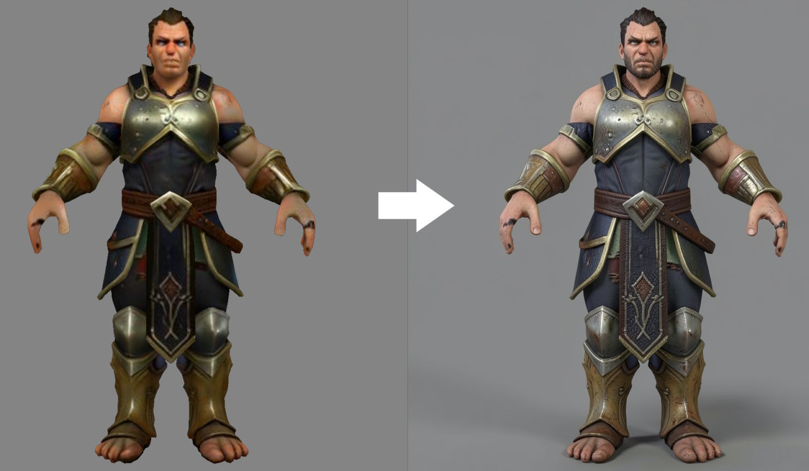
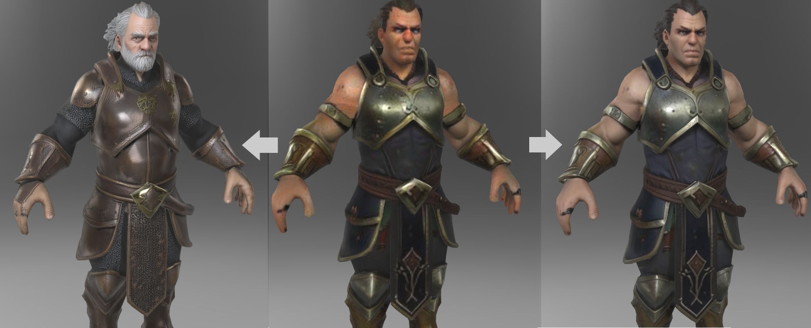

# ComfyUI-TextureProjection

A small ComfyUI custom node pack for camera-based texture projection onto trimeshes.

These nodes use [DRTK](https://github.com/facebookresearch/DRTK/) for rendering and projection, and are meant to slot into workflows where you:

1. Load a mesh
2. Render one or more views
3. Enhance those views with the image model of your choice
4. Project the result back into UV space



The UV projection step includes several quality controls to help multiple views combine cleanly:

- Overlap handling with soft visibility fades, so competing views blend more gracefully instead of leaving hard seams
- Edge fade to reduce artifacts near camera borders
- Normal-based weighting, so surfaces facing the camera contribute more strongly while glancing angles fade out
- Optional projection masks and opacity control to limit where a view is allowed to write
- Texture dilation after projection to fill tiny gaps and reduce fringe artifacts

## Nodes

- `TextureProjection Load GLB`
  - Loads a GLB file as a `TRIMESH`.
- `TextureProjection Camera`
  - Creates a `CAM_PARAMS` bundle for rendering and projection.
- `TextureProjection MultiView Camera`
  - Automatically creates six views: front, back, left, right, bottom, and top.
- `TextureProjection Smooth Normals`
  - Optionally merges duplicate vertices, recalculates outward-facing normals, and smooths normals across duplicate positions before rendering or projection.
- `TextureProjection Render Mesh`
  - Renders base color, depth, and normals from the supplied camera.
- `TextureProjection Project To UV`
  - Projects an input image from camera space back into UV space.
- `TextureProjection Trimesh To GLB`
  - Converts a `TRIMESH` into an in-memory `FILE_3D_GLB` object so it can be passed directly into native ComfyUI nodes such as `Preview3D` and `SaveGLB`.

## Example Workflows



The repository includes ready-to-load workflows in [`example_workflows`](example_workflows):

- [`flux_klein_basic_projection.json`](example_workflows/flux_klein_basic_projection.json)
  - A simple single-view render -> enhance -> project workflow. Good for learning the core projection loop.
- [`flux_klein_multiview_projection.json`](example_workflows/flux_klein_multiview_projection.json)
  - A multi-view projection workflow using the built-in multi-view cameras to combine several enhanced views onto one texture.
- [`sdxl_multiview_projection.json`](example_workflows/sdxl_multiview_projection.json)
  - An alternate multi-view example that also includes the smooth normals node, useful as a starting point for SDXL, Qwen Image Edit, or other image enhancement stacks.
- [`flux_klein_trellis2_retexture.json`](example_workflows/flux_klein_trellis2_retexture.json)
  - A retexture workflow that pairs the projection nodes with [ComfyUI-Trellis2](https://github.com/visualbruno/ComfyUI-Trellis2). It can be used to completely repaint an already textured mesh, or as a starting point for meshes that do not yet have usable UV textures.

## Requirements

This node pack expects a working ComfyUI environment with:

- PyTorch with CUDA support
- `numpy`
- `Pillow`
- `trimesh`
- `drtk`

## Installation

Clone or copy this folder into your ComfyUI `custom_nodes` directory:

```bash
cd ComfyUI/custom_nodes
git clone <your-repo-url> ComfyUI-TextureProjection
```

Install dependencies in the same Python environment that ComfyUI uses:

```bash
pip install -r requirements.txt
```

Install DRTK from the official project:

- https://github.com/facebookresearch/DRTK/

Prebuilt wheels for DRTK and various CUDA combinations can be found here: https://github.com/Aero-Ex/DRTK-Wheels/releases/tag/v0.1.0 if you do not want to bother building them yourself. Thanks to Aero-Ex for building them.

Then restart ComfyUI.

## Notes

- Standard projection workflows expect the mesh to already have UVs.
- The Trellis2 retexture example is intended for cases where you want to replace the existing look more aggressively, including meshes that may not already have a usable texture setup.
- CUDA is required for rendering and projection.

## License

MIT. See [LICENSE](LICENSE).
